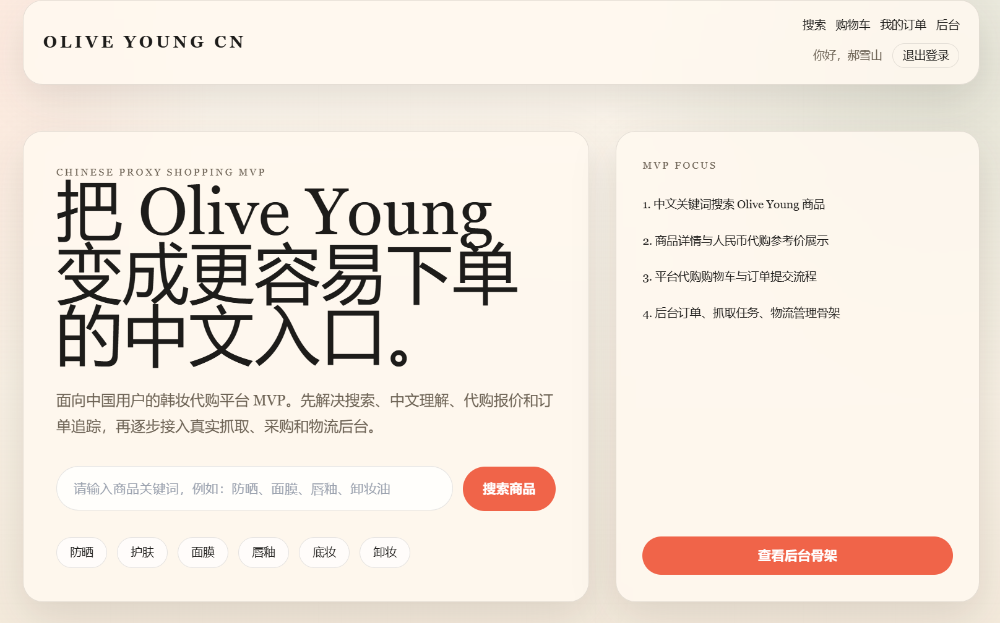
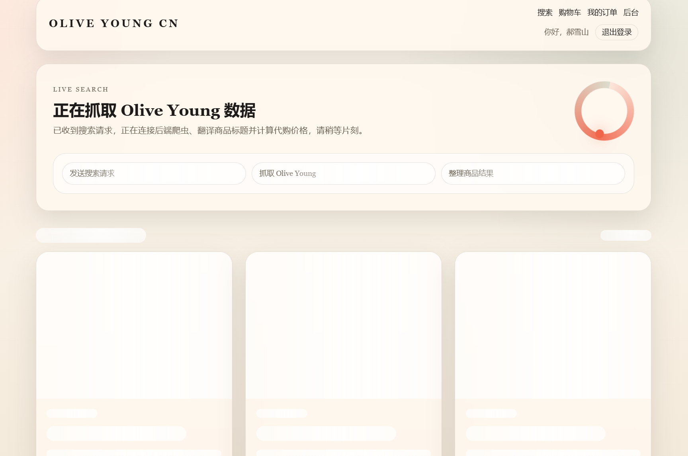
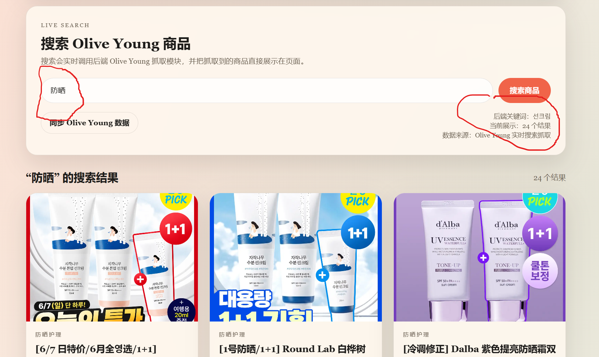

# K-Beauty Proxy Mall

**Olive Young 中文代购辅助平台**
**올리브영 중국어 대리구매 보조 플랫폼**

GitHub Repository:
https://github.com/haoxueshan/k-beauty-proxy-mall

---

## 1. 프로젝트 소개 / 项目介绍

K-Beauty Proxy Mall은 중국어 사용자가 Olive Young 상품을 더 쉽게 검색하고 확인할 수 있도록 만든 중국어 대리구매 보조 플랫폼입니다.

K-Beauty Proxy Mall 是一个面向中文用户的 Olive Young 中文代购辅助平台。

이 프로젝트는 한국어 상품명과 구매 과정이 어려운 사용자를 위해 상품 정보를 중국어로 보여주고, 장바구니와 주문 기능을 제공합니다.

本项目帮助中文用户更方便地查看韩国 Olive Young 商品信息，并提供购物车和订单提交功能。

---

## 2. 주요 기능 / 主要功能

* 상품 검색 / 商品搜索
* 상품 목록 페이지 / 商品列表页面
* 상품 상세 페이지 / 商品详情页面
* 한국어 상품명 중국어 번역 / 韩文商品名中文翻译
* 원화-위안화 참고 가격 표시 / 韩币到人民币参考价格显示
* 장바구니 기능 / 购物车功能
* 주문 제출 기능 / 订单提交功能
* 관리자 주문 관리 / 管理员订单管理
* Olive Young 상품 데이터 크롤링 API / Olive Young 商品数据抓取 API

---

## 3. 사용한 AI 도구 / 使用的 AI 工具

| AI 도구   | 사용 내용                                      |
| ------- | ------------------------------------------ |
| ChatGPT | 요구사항 정리, README 작성, 오류 해결, 배포 문제 해결, 발표 준비 |
| Codex   | 프론트엔드와 백엔드 코드 작성, 코드 수정, 버그 해결             |

| AI 工具   | 使用内容                            |
| ------- | ------------------------------- |
| ChatGPT | 需求整理、README 编写、错误排查、部署问题解决、发表准备 |
| Codex   | 前端和后端代码生成、代码修改、Bug 修复           |

---

## 4. 기술 스택 / 技术栈

| 구분                     | 기술                                       |
| ---------------------- | ---------------------------------------- |
| Frontend / 前端          | Next.js, React, TypeScript, Tailwind CSS |
| Backend / 后端           | FastAPI, Uvicorn, Python                 |
| Database / 数据库         | Supabase PostgreSQL                      |
| Crawler / 爬虫           | Playwright, BeautifulSoup                |
| Deployment / 部署        | Alibaba Cloud ECS, BaoTa Panel, Nginx    |
| Version Control / 版本管理 | GitHub                                   |

---

## 5. 실행 방법 / 运行方法

### Frontend / 前端

```bash
cd frontend
npm install
npm run dev
```

Frontend address / 前端地址:

```text
http://localhost:3000
```

### Backend / 后端

```bash
cd backend
python -m venv .venv
pip install -r requirements.txt
uvicorn main:app --reload --host 127.0.0.1 --port 8000
```

Backend health check / 后端健康检查:

```text
http://127.0.0.1:8000/health
```

---

## 6. 배포 / 部署

이 프로젝트는 Alibaba Cloud ECS 서버에 배포되었고, BaoTa Panel과 Nginx를 사용하여 관리합니다.

本项目部署在阿里云 ECS 服务器上，并使用宝塔面板和 Nginx 进行管理。

Online Demo / 线上演示地址:

```text
https://chan-downloads-briefly-apt.trycloudflare.com/
```

배포 구조 / 部署结构:

* Frontend / 前端：Next.js
* Backend / 后端：FastAPI
* Database / 数据库：Supabase
* Server Management / 服务器管理：BaoTa Panel
* Reverse Proxy / 反向代理：Nginx

---

## 7. 실행 화면 / 运行截图

프로젝트 실행 화면입니다.
以下是项目运行截图。

```markdown



```

---

## 8. 문제와 해결 방법 / 问题与解决方法

개발 중 가장 큰 문제는 Olive Young 상품 데이터를 가져오는 과정이 안정적이지 않았다는 점입니다.

开发过程中遇到的主要问题是 Olive Young 商品数据抓取不稳定。

검색 키워드나 네트워크 상태에 따라 상품 데이터가 정상적으로 가져와지지 않거나, 일부 상품 정보가 비어 있는 경우가 있었습니다.

根据搜索关键词或网络状态不同，有时商品数据无法正常获取，或者部分商品信息为空。

이 문제를 해결하기 위해 백엔드에 예외 처리와 기본 데이터 처리 로직을 추가했고, 크롤링 결과가 없을 때도 프론트엔드 화면이 깨지지 않도록 수정했습니다.

为了解决这个问题，我在后端增加了异常处理和默认数据处理逻辑，并修改前端，使抓取结果为空时页面也不会崩溃。

또한 Supabase를 사용하여 일부 상품 데이터를 저장하고, 반복 요청 시 더 안정적으로 상품 정보를 보여줄 수 있도록 개선했습니다.

同时，我使用 Supabase 保存部分商品数据，使重复查询时可以更稳定地展示商品信息。


---

